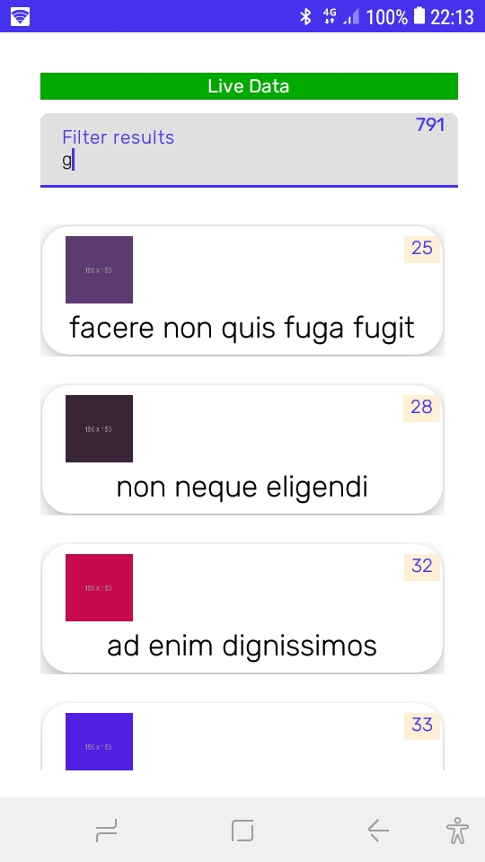

BCCATest is an example of Clean Architecture code in kotlin/android :

It loads an albums list from a JSON data source
and let the user filter the incoming data.

Data is also saved in a room database
and we use Glide library for image caching,
so it enables user to see the data 
when the device is off-line.

It uses the following components :

  * MVVM design pattern and data binding

  * kotlin-coroutines to execute code on
    various schedulers ( Database operations on IO scheduler, ... )
    it also uses the coroutines Flow feature to pass data from the model

  * OkHttp to fetch the data from the server

  * Retrofit to map the JSON data to kotlin objects 

  * RxJava to handle data changes ( Observables )

  * Lifecycle to process data only in STARTED state

  * koin for initialisation and injection of app modules ( like dagger )

  * Glide for image fetching and caching

  * Material design for the albums list UI

  * XPopupWindow for album details UI

author : chevil@giss.tv

